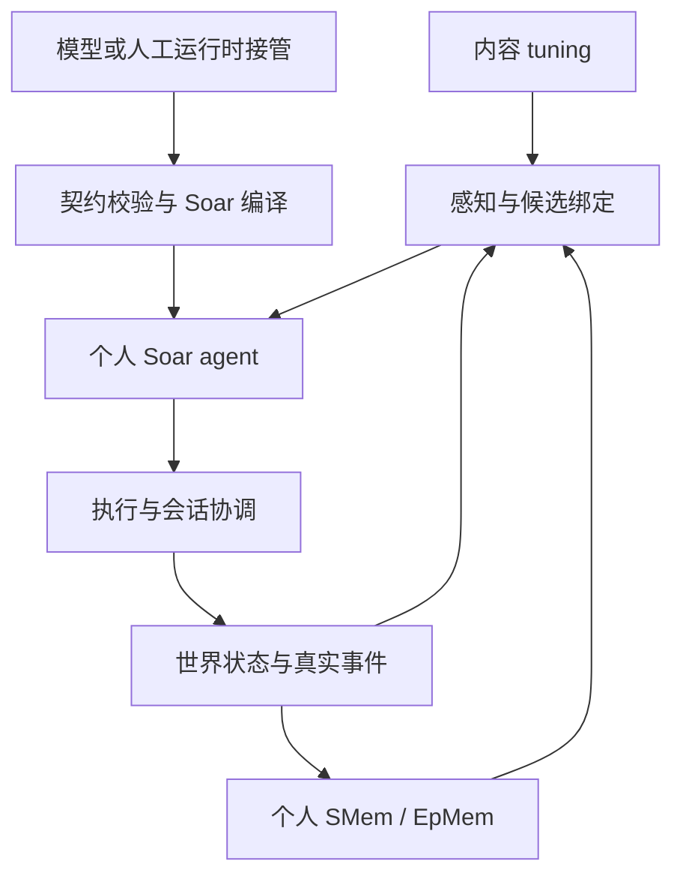

# 校园模拟基座 v1

本版本完成内容驱动的模拟内核与模型规则接口。后续校园前端已经接入，见 [校园前端说明](campus.md)；以下记录基座的模块与接口。这里的测试运行真实的 Soar 9.6.5 WASM，不是 JavaScript 假冒的规则解释器。

## 架构边界

| 模块 | 职责 | 不包含的内容 |
|---|---|---|
| `dist/content/*.json` | 物品、交互、条件、耗时、占用、效果、作息、情景种子和措辞 | JavaScript 执行代码 |
| `tuning.js` | 注册、校验、参数类型、条件表达式、增量内容包 | 特定校园角色、剧情分支 |
| `affordances.js` | 根据本人视图绑定对象，产生合法候选及目标步骤 | 人物剧情选择 |
| `space.js`、`execution.js` | 房间路径、移动、交互位置、资源占用、完成/失败/中断 | 借书或舞会专用行为 |
| `effects.js` | 可组合的原语与事务检查 | 按具体物品 ID 编写的效果 |
| `conversations.js` | 邀请、接受、注意力、多人席位、发言权、送达、退出 | 强制指定下一句台词 |
| `memory.js`、`goals.js` | 原生 SMem / EpMem、个人事实、分步目标与进度 | 用全局剧情游标替代个人记忆 |
| `policy.js`、`kernel.soar` | 编译、安装个人 productions、原生操作选择 | 预定剧情结局 |
| `calendar.js` | 作息相关时间、约定期限、按内容注入初始情景事实 | 运行时 AI 导演 |
| `presentation.js` | 从语义事实及 tuning 词汇组织展示文字 | 改变行动效果或数值 |
| `world.js` | 装配上述模块、推进时钟、提交事务、读写存档 | 校园内容 ID 或家庭 demo 依赖 |



基座代码不会根据 `notes`、`loan`、`drawing-kit` 等内容 ID 分支。测试还静态检查了这一点。角色绑定有显式依赖解析，JSON 键的排列不会改变交互能否成立。

## 内容文件

- `campus-tuning.json`：26 个交互、6 类物品、身体需要与作息、提议/约定语义、展示词汇。
- `campus-scene.json`：一个玩家、4 个 NPC、6 个房间、物品实例与初始归属；引擎允许一个玩家和最多 10 个 NPC。
- `club-extension.json`：额外的绘画材料包与画海报交互。加载它不需要修改引擎。

物品类型定义 `tags`、默认 `state`、可见字段 `visible`、查看后才得知的 `inspect` 字段、可交互 `slots`。实例只引用类型并给出位置、初始状态和持有者。`mapKnown` 表示角色初始知道该固定设施的位置，会进入各自原生记忆；不揭示设施在视线外的当前状态。

交互定义：

| 字段 | 含义 |
|---|---|
| `roles` | 从可感知人物、物品、本人获知的提议、邀请、群组和消息中绑定参数 |
| `parameters` | 外部参数的类型、默认值、枚举、数值界限 |
| `when` | 候选条件，只使用该角色当前可知的视图 |
| `requires` | 完成时根据真实世界再次检查的条件 |
| `executor` | `instant`、`physical` 或 `speech` |
| `anchor` / `slot` | 必须走到的位置，以及座位、床位等占用点 |
| `duration` / `cooldown` | 游戏分钟及重复执行间隔 |
| `attention` | `none`、`pause` 或 `block`，决定交谈能否中断当前活动 |
| `effects` | 按序执行的已注册原语；某个效果检查失败，整组世界变更不提交 |
| `need` / `defaultPriority` | 身体 utility 或共享基础策略的候选优先级来源 |

表达式支持 `all / any / not` 与 `eq / ne / lt / lte / gt / gte / includes / exists`；引用使用 `$actor`、`$target`、`$item`、`$offer`、`$message`、`$args`、`$clock` 等明确根。未知值不会被当成两个相等的已知事实。

现有原语包括需要变化、物品状态与数量、拿取/放下/授权交接、查看、邀请/加入/离开会话、结构化发言、传递已有知识、创建/回应提议、形成/履行约定、群组建立/退出和事件发出。交接权与归还权由提议的 tuning 声明。

```js
const extension = await fetch('./content/club-extension.json').then(r => r.json());
world.extendContent(extension, [{
  id: 'club-art-kit', type: 'drawing-kit', room: 'classroom', x: 0, z: 1
}]);
```

增量包可添加类型、交互、提议、谓词、作息条目与情景种子。重名被拒绝，避免悄悄改变正在执行的交互。新底层原语需要实现对应 handler；组合已有原语的内容不需要改代码。这是当前扩展边界，不宣称数据能凭空实现所有物理能力。

## 模型怎样使用基座

```js
const request = world.inbox.request('m', '需要处理刚收到的新请求', ['offer-15:status']);
// 将 request.context 交给模型，或由开发者在运行中接管。
await world.inbox.apply(reply);
world.advance(4);
```

`request.context` 包含本人可见事件、本人原生记忆、持续目标、当前合法候选、已有个人规则、可用能力契约。不带其他人物的私有认知。无人处理的社交请求会自动排入待生成队列；世界不等待网络响应，可以继续推进。当前没有自动网络 provider，开发者工具以 JSON 文件交接。

回复可以追加/修订个人规则并添加分步目标。例如：

```json
{
  "id": "answer-known-request",
  "select": {"action": "answer-known"},
  "when": [{"scope":"memory","key":"offer-15:status","op":"eq","value":"accepted"}],
  "priority": 80,
  "reason": "依据我已接受这次请求的记忆作答。"
}
```

该规则声明经 `compilePolicy` 生成原生 Soar `sp` productions，再交给原生解析器和当前候选试运行。执行时是 Soar 提出、比较和选择 operator。`reply.source` 可以附上编译后的源码，但必须与声明一致。此接口不接受任意 CLI 或任意裸 Soar 修改世界/记忆命令；不是把前一轮模型产生的原生源码直接无约束热加载。

规则优先级、合法字段、证据可见性、内容版本、个人规则版本、读档世代和相关事实依赖均有检查。无关时间流逝不使回复自动过期；被依赖的事实改变会拒绝旧回复。新增包保留之前的个人规则，原生安装失败时保留旧程序。目标和规则的定义在安装前检查。

目标定义及每个步骤单独存入原生 SMem；进度也是个人原生记录。完成行动后才推进步骤。原生语义查询默认读取深度有限，因此没有依赖一次查询就自动取出任意嵌套任务树。暂停保存剩余时间、释放位置；恢复重新取得位置。取消不伪造目标完成。

## 本次运行时接管

两次接管均由 ChatGPT 在看到运行现场后编写，没有调用 DeepSeek。

1. T 当面向 M 借笔记，M 收到真实提议；第一次接管生成同意规则及交接任务。M 在自己的发言轮回应，再实际交出物品，任务进入完成状态。
2. T 追问约定是否仍有效；第二次接管读取 M 已接受且已交接的记忆，生成回答规则。M 引用已有事实回复，保留原始来源和 `replyTo`。
3. T 归还笔记，物品持有者改回 M，约定标记为履行。F 看到了物品交接，但没有获得自己没参加的谈话内容。

`research/foundation/` 保存两次请求、回复、生成的 Soar 源码、运行轨迹和复测结果；初次集成暴露的计划读取问题也单独保存。修复后复测复用这两份回复，不冒充新的在线模型生成。

## 运行与验证

```bash
node --test tests/foundation/kernel.test.mjs
node scripts/replay-foundation.mjs
node scripts/foundation-lab.mjs
```

第三个命令启动保持内核存活的交互调试进程，在标准输入接受 `reply / advance / ask / return / status / finish` JSON 命令。前两个命令均不需要密钥，也不会访问模型 API。

机制验收包含：原生规则安装与执行、物品位置和独占资源、借还与防重复、内容包扩展、多人/多轮送达与晚加入、群组自愿加入、暂停/恢复/取消、原生存档、版本与证据拒绝、约定超时和有方向的情绪记录。没有把“拒绝邀请是否符合人设”列为本轮通过条件。

## 当前范围

基座现已接入校园场景、人物动画和玩家菜单；真实运行时网络模型服务尚未默认启用。空间使用房间图、门户、交互点和基于家具轮廓的网格寻路。角色通常依赖原生规则、计划、身体需要和作息行动；不会自动编出完整校园剧情。

本次共用的人际评价沿用已有 Soar 认知原语，尚不是完整人格或情绪系统。默认 choices 在同优先级时稳定排序，未新增随机剧情导演或宣称已训练新的 RL 策略。输入历史和候选规模有局部上限，但没有做长时间、多倍速性能验收或全局历史归档。
