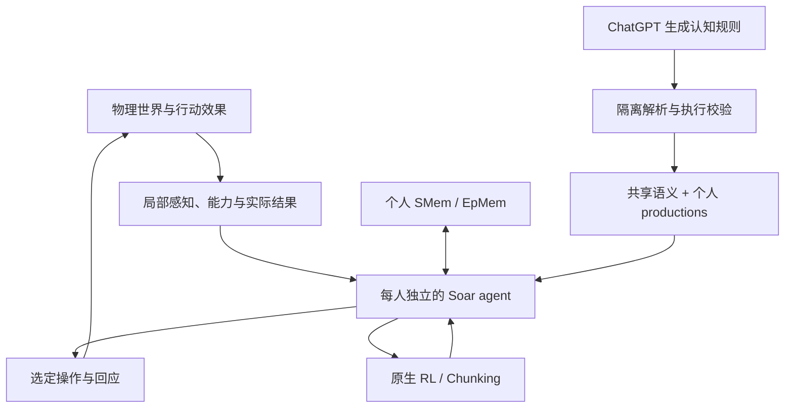

> 历史家庭实验说明。以下结果对应旧入口 `dist/family.html`，不代表当前校园版本；当前架构与运行方式以根目录 README 为准。

本次校园修订：19 个区域使用公共通路；新增人物与长期计划面板、可跨日恢复的原生 Soar 目标，以及实际参与决策的认知参数。实现与明确边界见 [docs/campus-planning.md](docs/campus-planning.md)。

# 青禾高中 · 校园扩充

当前校园包含 17 个区域、148 件物品、84 个交互。新增分设的男女卫生间、实验室、音乐教室、体育馆、种植园、走廊和学生活动中心；库存、访问权限、餐食和学习资源由 tuning 驱动。见 [扩充规则与验证说明](docs/campus-expansion.md)。

当前更新见 [docs/campus-space.md](docs/campus-space.md)：设施进出与独占、交互动作、人物避让和可寻路的全校总览。

本次修复见 [docs/player-autonomy.md](docs/player-autonomy.md)：玩家自主生活、手动接管、课堂考勤与真实补课。

当前校园修复说明见 [docs/campus-repair.md](docs/campus-repair.md)：持续课堂、可拒绝的情景协作及渲染优化。

# 青禾高中：Soar 校园生活 demo

校园前端已接入独立模拟基座，入口为 `dist/index.html`。9 个区域、54 件物品、57 种 tuning 交互与原生 Soar 角色，详见 [docs/campus.md](docs/campus.md)。基座接口见 [docs/foundation.md](docs/foundation.md)。下文记录保留在 `dist/family.html` 的家庭版本。

每天有一个家庭情景，五个人在 2.5D 卡通小屋里自主参与并持续生活。角色的行动和回应由真正的 **Soar 9.6.5 C++ 内核（WebAssembly）**选择；可以拒绝请求、记住经历、调整策略、保留未完成的目标和承诺。导演安排处境、私有信息与可组合的行动知识；实际互动和后果由运行结果决定。

本次已经启用原生 **Working Memory、Semantic Memory、Episodic Memory、RL 和 Chunking**。五位角色各有独立 agent、production 集、记忆数据库、学习数值和规则版本。JavaScript 中的最近事件列表用于展示；个人心智投影是原生 Soar 输出的缓存，供感知过滤、候选绑定和界面使用，认知修订、归因及情绪计算仍在 Soar 内完成。


## 由情景知识驱动的家庭生活

默认从“小雨急着筹钱”开始。四个情景参考央视公开的《家有神探》《小汇报》《给家里打工》《别出声》简介，采用原创改编台词，不安排固定发言顺序与必达结局。

| 情景 | 真实能力与可见后果 |
| --- | --- |
| 小雨急着筹钱 | 私下求助、挪动物品、借款、查问、澄清、修理、归还画册、还钱和道歉 |
| 小雨的消息有了价钱 | 报告计划、奖励、提出保密交易、对方接受后才付款、当面核实、讨论并停止按消息发钱 |
| 家务卡到底怎么算 | 实际劳动及质量记录、上门验收、拒付、讨价还价、修改标准、返工、重新验收和真实报酬 |
| 刘星说自己一点也不怕 | 实际观看、恐惧状态、找借口求陪伴、坦白、当面安慰、走到床边开灯、后续改变影片选择 |

`dist/situations/catalog.js` 是 ChatGPT 编写的结构化情景知识；`schema.js` 校验人物、条件、效果能力与预算，并把每条人物策略编译为真正的 Soar productions。`runtime.js` 负责物品、资金、质量、感知、行动完成检查和消息传递。规则条件读取**该人物自己的原生记忆结果**，JavaScript 不按剧情索引选择下一句。

每个候选携带 caseId、规则包内容版本、行动 token、个人 belief 和完成记录。行动选择及会话发言在独立原生 agent 内完成，执行时再次校验。角色先寻路接近，邀请实际送达、对方接受并就位后才交谈；每条信息只进入实际听到者的原生记忆。一对一和多人沿用同一会话协议。行动完成记录同样保存在原生记忆，实物及资金账本负责验证执行和避免重复付款。

日常饭点、睡觉、上学上班优先级仍高于情景。周中早晚在家，白天正常离场，周末在家。未解决的情景跨日继续，下一天不会重新制造另一件相同事件。解决以后再提出另一类情景；已有借款、关系、物品和个人长期知识不被清空。恐惧数值由引擎随时间衰减，Soar 根据强度、面子与求助知识选择行为；这不是完整的心理学模型。家务标准和影片选择的跨日记忆可以改变再次面对同类情景时的操作。

旧有小节目、家庭餐馆、出游计划作为旧存档兼容方法保留，使用 `scenario:'show'` 的专门测试继续覆盖旧流程。它们不再是新生活的默认玩法。

### LLM 的实际入口与边界

默认没有运行时模型 API 请求。当前情景与人物策略由 ChatGPT 在开发阶段编写、观察真实模拟后修订；台词是规则包里的候选表达。联网模型可在既有日终接口的 `nextEpisode.situation` 中重组事实词汇、私有 seeds、行动条件、优先级、台词和受支持的效果；这些知识再编译成 Soar 程序。个人反思仍可直接返回 `learned*` 原生规则。`research/situation-model-response.json` 保存以实际垫款事件为依据生成下一天新情景包的输入与响应，测试让世界在响应等待期间继续运行，并执行新包中的劳动和验收。

新情景包没有任意 JavaScript、脚本游标或强制结局能力。已注册效果是 remember/tell、repair/move、transfer、clean/inspect-work、policy、fear/comfort、social。未知效果被拒绝；新增社会语义或物理能力仍需开发对应实现。可自由组合已有能力，不意味着已具备无限玩法。

物品目前包含小汽车、画册、家务质量记录与床边灯的简化表示；没有校外买卖场景、自由文本实时聊天、任意谎言规划，也没有端到端的在线模型质量测量。基本图形和使用动作沿用现有 2.5D 小屋。完整家务合作分账尚未实现，当前小雨会提出合作请求并独立完成适合自己的任务。

### 实际观察与验证

`tests/situations.test.mjs` 让五个人自主运行多日，检查实物、钱、送达、人格规则与后续影响，并做同开局规则对照、原生记忆读档、重复付款与日终新包安装验证。`research/situation-verification.json` 保存真实行动时间、台词、触发规则、理由、听到者、物品、资金和债务；它不是预写出来的故事。其余回归测试覆盖生活、作息、认知、会话与学习。

## 玩什么、怎么看

- 点击人物看持续数日的意图、阶段进度、当前步骤与比较过的完成方法；可以安排一个具体行动，其他人继续自主生活。
- 请求别人小声一点、帮忙、吃饭或和好，对方自行决定。帮忙可以答应稍后兑现，承诺在实际完成后才被标记为兑现。
- 点击家具改变电视声音、书桌占用和食物供应。行动受真实寻路、耗时和共享资源限制。
- 右上角 **Soar** 面板展示实际输入、回忆、判断、触发规则、SMem、EpMem、RL 数值、奖励记录和生成的 chunks。
- 本轮 ChatGPT 生成的刘星认知修订默认加载。它只有在原生 EpMem 召回亲身被打扰的经历时才生效。可以撤回、重新加载，或粘贴新的 `learned*` productions。
- **打开验证用存档**后，刘星正在看电视，也已经有真实学习被干扰的经历。选夏雪，请刘星小声一点；分别撤回和加载新规则，可从相同存档比较回应与电视状态。**回到原来的家**恢复实验前完整状态。
- 完整进度自动保存到浏览器 IndexedDB，包括原生 SQLite 记忆和学习结果；也能下载、读入 JSON 存档。旧版仅存 JavaScript 状态的存档不兼容这个新内核。

## 一对一、多人和群组会话

人物面板里的“一起说会儿话”支持多选家人、选择话题、邀请中途加入、排队提出下一个话题以及主动离开。预设“一家人 / 爸妈 / 姐弟仨”三个持久群组，也可创建小组；新组只有创建者先加入，受邀者实际听见并接受邀请后才成为成员。组员可以退出；组员身份不会迫使角色参加每次会话，也不会把远处的组员当作在线聊天室用户。

- `dist/conversations.js` 管理共同会话、邀请期限、位置、发言轮次、送达记录和暂停任务。每个人至多参与一场需要注意的会话。邀请未送达、拒绝、延后、就位、退出是不同状态。
- `dist/soar/conversations.soar` 为邀请、持续参与、说话三个阶段提供操作与偏好；每个人独立运行，并接受个人 productions 的覆盖。邀请冲突按实际送达及接受顺序处理，第二场不能直接改写角色已经接受的会话。
- 吃饭、休息、看电视可以同时交谈；暂停型活动保存原任务、剩余时间、已获得的进度和位置，并释放家具。恢复时重新检查并取得资源，不重复执行开始效果；家具被占时等待，仍允许身体紧急需求和作息插入。做饭等需先做完的活动可以延后加入，睡眠阻断普通邀请。
- 1v1 和多人使用同一个协议。全组请求产生面向各个接收者的独立请求及 Soar 回应；答应帮忙形成既有承诺，兑现后才反馈奖励。参与者自己选择回答、承认不知道、追问信息来源、质疑矛盾、解释原决定或确认听到。
- 发言权是共享的物理协调状态：优先让被提问者回应，其次让等待较久的人说；每次只有一个发言者。实际内容和是否继续参与由各自的 Soar 选择。问题保留 `replyTo` 和话题，未回答的问题可以超时；会话结束会取消尚未回答的请求，但不会撤销已经答应的承诺。
- 新话题先排队成为一个真实发言，再更新实际听到者的当前话题。中途加入的人不补发旧轮次。每个 agent 只收到自己的 `heard` 记录；台词的公共陈述不携带发言者的私有归因、RL 推理或完整计划对象。对方未参与或听不清时不会自动获得会话内容。
- 会话、席位、发言权、未答问题、剩余任务和小组随完整存档保存。原生 SMem / EpMem 记录实际听到和说出的内容；日结也按送达范围过滤会话记录，可以据此生成新的个人参与或交流规则。

共享 tuning 的 `actions.*.conversation` 支持 `parallel / pause / finish / unavailable`；`conversation` 定义邀请和就位期限、轮次时长、参与人数、空间距离及冷却。日结可调整这些数值和个人规则，不能强改当前组员或历史谈话。热加载会在已观察到的行动、邀请、参与和发言情境中校验新增规则，失败保留旧程序。

当前 demo 只有五位角色，默认一场最多五人、24 个发言或 28 游戏分钟；这些是调度上限，谈话可以更早自然结束。可执行的话题包括每日情景的提议、条件、修订、答应、拒绝、展示准备，以及物品位置与证据、家庭请求与解释、各自安排；台词由所选语义行为和情景资料组织，没有任意自然语言输入、无限开放话题或运行时 LLM 对话。旁观者不自动参加正式会话；普通喊话请求仍走原有的局部听觉事件通道。会话意愿目前使用原生规则偏好，原生 RL 继续用于已有请求回应策略，没有另外声称训练了会话规划模型。

验证见 `tests/conversations.test.mjs` 与 `research/conversation-verification.json`，包括双方参与、多轮关联、五人发言、延后加入、暂停恢复、资源竞争、听觉隔离、抢占冲突、群组自愿成员、话题切换、玩家打断、存档续接、日结隐私及坏规则拒绝。

## 家庭作息、持续意图与日终反思

家庭共享饭点：早餐 07:15—07:45、午餐 12:15—13:00、晚餐 18:30—19:15。工作学习有三个时间段，五个人分别有就寝/起床时间。普通用餐受饭点及本顿是否已经吃过的条件约束；临时零食、身体紧急情况和玩家安排有明确的例外依据。长时间睡眠持续到预定起床点。共享作息是生活约定，不保证任何条件下都能按时做到。

`routine.js` 只把时钟变为作息事实。**是否进食、备餐、睡觉、等待、推进个人目标，仍由原生 Soar productions 选择。** 到饭点可以暂停普通娱乐或占用餐桌的工作；未完成任务的进度留在 SMem 中。用餐不依赖每次模型调用。

`planning.soar` 把跨日意图存为 SMem 的 `intention`：稳定 ID、动机、方法、完成里程碑、起始日、截止时间、准备阶段和修订号。它从共享能力的进度效果、耗时、路程、资源等待与噪声影响估计完成代价，比较书桌/餐桌等方法；在身体条件不够时选择支持步骤。当前方法按条件推进，打断后重新检查，而不重置人生目标。人物面板展示实际目标、当前依据、比较结果；Soar 面板保留原生推理触发记录。

点击左侧 **作息与日结**：

- 查看共同饭点、工作时段和个人睡眠安排。
- 每天午夜形成真实日结：用餐时间、错过饭点、任务中断、进度、人物可知的经历、仍有效的计划及之前的反思修改。
- 日结可以导出给 ChatGPT，读入返回的世界 tuning / 个人 `learned*` 规则补丁。每项修改需要真实事件 ID、理由和版本匹配。
- 反思先在隔离的原生 agent 中解析、试运行，再整体应用。撤回恢复旧规则，同时保留此后发生的经历、当前记忆和 RL 值。模型可以明确返回无需修改，此时不增加规则版本。
- **体验这次真实日结的规则修改**提供实际自主运行两天后的存档，以及 ChatGPT 读取第二天日结后写出的刘梅采购规则。应用后继续生活；也可以回到刚才的家。

运行时默认**没有连接模型 API**。可填自己的 HTTPS 服务地址，服务每天分别接收一个家庭 tuning 上下文、五个互相隔离的个人上下文及一个导演上下文（`reportForModel(report, person)`），各次返回 `patchSchema` 所描述的 JSON；也可用 `window.familySetReflectionProvider(async (report, {signal}) => patch)` 对接服务。异步请求期间继续生活，超时继续旧规则，读档/重新开始取消旧请求。浏览器中不保存模型密钥。已生成的两份验证补丁不会冒充每天自动生成的结果。

世界补丁支持已有 `routine`、`needs`、`actions` 及部分项目预算字段。简单字段可用 `routine.meals.dinner.start`；带点号的效果键使用 JSON Pointer，例如 `/actions/eat/finish/self.hunger`。不能通过补丁改历史、角色身份或绕过原生执行检查。新社会概念、任意新效果类型仍需增加语义实现。

本次两次实际日终反思：

1. 第一天东海稿子只完成 73.73/100，并记录亲身受到电视干扰。ChatGPT 加入“持续噪声时先协商，再继续写”的规则。
2. 第二天全部三餐在饭点内发生，但刘梅早餐前收配送，07:57 才入座。ChatGPT 加入“已有足量饭时，不启动无法在饭前完成的非必要采购”的规则。

从相同条件做受控再次暴露，修改前后分别出现“继续被打扰地写 / 主动协商”和“立即采购 / 留出用餐时间”。这些测试验证规则的行为影响，不能证明模型会对无限新情境持续生成合理知识。详见 `research/day-*-report.json`、`day-*-patch.json` 和 `day-reflection-verification.json`、`cognition-verification.json`、`episode-verification.json`、`acceptance.json`。

## 个人认知、空间、沟通与情绪

本次补齐的链路是：世界发生变化 → 各自看到/听到 → Soar 记录和修订自己的判断 → 针对具体事件评价 → 选择应对 → 实际结果再次进入记忆。

- **空间**：视距、现有隔墙、卧室隔音帘、声音传播、语音可辨距离和睡眠状态共同决定输入。听到电视不等于认出看电视的人。任务内心的分心、错过饭点、查看失败不会自动广播给旁人。帘子是可穿行的布帘，不改变寻路地图。
- **物品**：饭锅、储物格、零食盒和可移动的练习本有独立实体；容器里的数目要靠查看或转述。食物数量的真实账本仍只有一份，避免对象库存与家用库存分叉。候选使用个人上次知道的数量；可能走到地方才发现空了。饭点遇到过时的空库存记忆时，Soar 会主动重新查看；这是本次七日测试暴露漏餐之后补入的规则。已有家具租用若在视线外，不会提前从候选里消失。
- **找东西**：人物面板可交代“找练习本”。Soar 优先选择最后记得的位置，再查看其他位置；执行反馈更新信念。同样的查找规则接受物品 ID 与位置，不包含固定剧情顺序。
- **信息**：`tell` 传递结构化 claim，并分别记收听、理解和当前判断。Soar 选择从自己的知识中说什么；单一转述保留为 tentative，冲突保留为 disputed，亲自确认后修订。每条消息保留原始来源标识，A→B→C→B 不会变成多个独立证据。当前没有自由自然语言解析、欺骗意图生成或复杂概率信任网络。
- **状态与心情**：身体需求仍由物理层推进；Soar 根据自己知道的请求结果、当前目标受阻、承诺和精力进行评价。情绪记录有对象、领域、证据、原因、强度和时间；即时情绪以 0.18/游戏分钟衰减，余留紧张以 0.025/游戏分钟衰减。多个对象/领域可并存，同一对象同一领域保留当前评价，过往证据仍在原生记忆中。余留紧张在精力不足时会让 Soar 提出短暂休息，恢复后继续原意图。当前心情是这些较慢状态的投影，不是完整情感心理学模型。
- **人物差异**：东海倾向核实、刘梅倾向当面讨论、夏雪关注原因与公平、刘星容易先退开、夏雨偏向寻找陪伴。这些是各自 production 中的评价参数和应对规则，实际提出不同操作；体力会调节强度。
- **关系**：判断是有方向、有领域的原生记录。知道对方有合理冲突与明确失约产生不同后果；在一件事上得到解释不会清除另一领域的失约。总体关系数字只汇总这些记录，后续应对读取具体评价。
- **解释**：人物面板展示本人记得的位置、来源、冲突、针对谁的情绪、原因和准备采取的应对。UI 不为模型临时编一段内心独白。普通台词仍用实际语义消息和实际动作渲染成模板。

在“家中物品”里可以拉上帘子或挪动练习本，再看各人的记忆是否变化。人物面板的“找练习本”展示从旧记忆寻找的过程。Soar 面板增加 **新反思：先问清原因**，可载入本次 ChatGPT 根据真实受挫记录写出的规则；不会自动抹去此前噪声规则，应用按钮当前按整个编辑框替换个人增补包，如需并用需保留两份源码。

日终导出会按当前选中的人导出其个人上下文；没有选择人物时导出家庭作息维护上下文。HTTP 接口分别请求世界、五个人和导演上下文并限制返回补丁的目标，个人请求不包含其他人的私有心智或私有项目。直接接入自定义 provider 的开发接口仍是受信任的调度入口，调用方必须保持同样的上下文隔离。

## 技术边界



| 部分 | 实际实现 |
|---|---|
| 共享语义 | `dist/domain/family.json` 定义 Observation、Belief、Goal、Commitment、Method、Assessment；22 类行为的资源、代价、耗时、效果、进度及角色限制；请求的中断语义 |
| 世界执行 | `dist/simulation.js` 维护时间、身体需求、位置、寻路、家具租用、行动阶段、社交协议和实际后果；从 tuning 枚举能力，执行声明式效果 |
| Native 桥接 | `kernel/bridge.cpp` 将嵌套对象转换为 SML WMEs，运行有阶段预算的认知事务，读取 output-link，记录原生触发回调和实际 decision-cycle 计数 |
| 共同认知程序 | `memory.soar`、`mind.soar`、`communication.soar`、`conversations.soar`、`contracts.soar`、`cognition.soar`、`planning.soar`、`base.soar`：记忆写入/检索、持久目标、承诺状态、子问题解释、操作选择、身体维护 |
| 日终更新 | `reflection.js`：真实日结、异步 provider、证据与版本校验、隔离试运行、世界和个人规则事务、撤回 |
| 个人程序 | `dist/soar/people/*.soar`：独立检索线索、解释规则、行动偏好和对后果的评价，不读取头像旁的性格文字标签 |
| 学习 | 原生 numeric-indifferent RL productions 更新策略价值；原生 substate 推理经 `force-learn` 产生 chunks，后续直接触发 |
| 规则更新 | `dist/soar/controller.js` 在隔离 agent 中解析规则并运行当前情境，成功后替换目标角色的修订；保留生活与记忆，清除旧推理生成的 chunks；失败保留原规则 |
| 存档 | 保存世界执行阶段、未处理请求/反馈、每人的 SMem/EpMem SQLite 数据、完整 productions（含 RL 值及 chunks）、版本和已消费结果 ID；恢复时重新建立 WM |
| 场景 | `dist/scene.js` 的程序化卡通网格；原有可旋转缩放小屋和五个人物持续展示实际行动 |

### 人物差异如何参与计算

| 角色 | 回忆与理解 | 行为上的区别 |
|---|---|---|
| 刘星 | EpMem 检索自己的受干扰经历；初始把要求理解为对自己安排的干涉；生成规则可识别双方活动能够兼容 | 无经历时倾向拒绝；有亲身经历且只是调小电视时愿意接受，仍可能拒绝额外家务 |
| 夏雪 | SMem 检索请求者过去的合作证据，检查要求是否中断学习 | 一般会商量稍后帮忙；记得对方帮助过自己时，可以为回报而接受中断 |
| 刘梅 | SMem 检索尚未兑现、别人欠自己的承诺 | 没有欠账时倾向分担；有未兑现承诺时更强调责任 |
| 夏东海 | 回忆亲自听到的拒绝；调解行动必须匹配记忆中的具体事件 | 会为共同需要让步，也会根据此前拒绝先协商时间；不会凭全局冲突表知道一件没听到的事 |
| 夏雨 | 以当前玩耍兴趣与陪伴需要作为判断条件，保留并检索自己的玩耍经历 | 还想玩时倾向拒绝打断；满足后更愿意响应家人的邀请 |

这是可编辑、可学习的领域认知程序，不是声称经过心理学验证的人格模型。

### 数值、RL 和 chunking

身体需求与资源按世界规则计算。请求是否打断当前任务，由 Soar 读取共享语义后在 substate 中推理；个人规则再决定这次如何理解，RL 在已提出的回应方法之间选择。

原生 Soar 现在默认使用 epsilon-greedy 探索，`epsilon=0.1`，新建及读档重建的五个人物均生效。在到达 indifferent 选择阶段时，10% 的机会从候选中随机选择，90% 选择当前最高数值偏好的候选；随机选择也可能选中原本最优的方法。明确的 better/worse、禁止偏好和单一候选不被这个参数推翻，因此当前主要增加社交回应方法的变化，不会自动让所有情景行动随机化。`tests/exploration.test.mjs` 使用原生随机种子验证实际回应分布、读档后的参数及生活约束。

结果反馈提供“原活动是否保留／完成”“请求是否实际兑现”“是否产生关系代价”等测量。每人的 production 使用不同公式赋值，再由原生 RL 修改 numeric-indifferent 值。答应稍后帮忙不会立刻得到成功奖励；完成或逾期才反馈，同一结果只消费一次。

当前实现使用**显式结果反馈的局部策略学习**：在反馈事务中重现原策略及考虑因素，执行原生 TD 更新；普通感知、读写目标不产生训练。配置了资格迹衰减 `0.7`，但当前训练回合只针对一个社交策略，**没有实现任意长行动链的信用分配，也没有另外实现 bucket-brigade 算法**。它不能凭 RL 自动产生未知行为或新的社会概念。

Chunking 与 RL 分工不同：前者把确定性的子问题推理编译成 production；后者学习现有选择的价值。测试确认真的产生并触发 chunk，并在移除原来的子问题规则之后仍能使用已编译结果。

### 扩展语义和规则

修改 `dist/domain/family.json`，然后运行 `python3 scripts/assemble-domain.py` 同步浏览器模块。动作由调度器根据资源和声明式效果执行；在既有身体、物品、效果类型中添加能力，不需要新增 JavaScript 行为选择分支。测试实际增加“伸展”能力，通过新 production 选择它，并验证体力恢复。

全新效果类型（例如职业晋升）、新空间或复杂社会协议仍需要相应世界实现。tuning 不是任意自然语言的执行器。

人物的规则可引用共享结构：

```text
观察事实 → Soar 选择检索线索 → 召回个人经历／信念
→ 根据目标和请求语义解释 → 提出方法 → 原生 preference / RL 选择
→ 世界执行 → Soar 记忆与个人结果评价
```

`dist/soar/learned/xing-v2.soar` 展示的是修改解释过程和提出操作的规则；没有直接规定下一场戏或向世界强写结局。`research/reflection-input.json` 是物理世界运行产生的真实依据，`research/reflection-output.json` 解释本次生成的规则。

**本轮由对话中的 ChatGPT 代替外部 API 生成、修改和测试规则。外部 API 调用次数为 0。** 可导出个人原生记忆和程序，交给下一轮 ChatGPT 继续生成规则；游戏尚未部署运行时模型服务或自由语言对话解析。简短台词是行动结果的模板表达。

## 验证与复现

```bash
node --test tests/autonomy.test.mjs tests/life.test.mjs tests/routine.test.mjs tests/reflection-lab.test.mjs tests/assets.test.mjs tests/cognition.test.mjs tests/conversations.test.mjs tests/episodes.test.mjs
```

- 12 项原生内核测试：五 agent 行为、个人记忆隔离与来源、原生目标进度、认知差异、EpMem 规则适用边界、实际 chunk 复用、RL 改变选择及反馈去重、承诺完成/逾期/取消、延后兑现、完整读档、非法规则回滚/撤回、tuning 扩展、资源与感知约束（部分合并在同一测试中）。
- 19 项共同会话测试：一对一、五人轮次、独立回应、群组、自愿加入、后加入者隐私、隔音与睡眠、争用、暂停与资源恢复、玩家改令、存档、日结及坏规则拒绝。
- 2 项生活测试：真实物理经历后的相同存档 A/B 对照；连续七个游戏日的自治生活，以及第八天恢复存档继续运行。长期验收要求有真实信息交换、关联的多轮回应、合作后果和生活持续性，不要求固定种子必然发生争执；拒绝与延期由独立的对照场景验证。
- 9 项作息和日结测试：共同饭点、连续睡眠、跨日与读档、家具阻碍后的方案修订、玩家中断、紧急例外、世界补丁、个人规则、错误/超时/取消/无变化处理（部分合并）。
- 1 项真实反思规则对照：读取本次两份已生成规则，在相同条件下分别加载和撤回，验证行为差异；同时验证世界补丁中的声明式效果。
- 12 项认知真实性测试：隐藏库存、隔墙/睡眠、旧位置查找、转述来源与冲突、人格和疲劳对照、分领域关系与重评、原生读档、个人日结隔离、同存档生成规则对照及多次经历后的数值边界、真实询问到归因纠正的完整链路、旧空库存导致等待的回归。
- 7 项每日情景验收：实际协商和准备、改人物规则后的结局/次日变化、五人家具使用、通勤、周末、私密原生记忆与读档、异步导演及过期结果。
- 8 项新情景测试：四类自主场景、同开局改变原生条件、私密开场、完整读档与付款、会话及日结隐私、搬运中读档、非法模型能力、实际日结生成新情景包。
- 1 项静态接入测试：浏览器入口语法、界面控件、模块/资源路径、tuning 与生成模块的一致性。

本版 71 项检查通过（完整回归及对调整后的隐私等待条件定向复验）。连续七个游戏日内，正常饭点出席率 100%，饱腹/精力最低 36.22/100。未解决的事件会跨日继续，不要求每天强行完成一集。真实场面和决策依据见 `research/situation-observation.md`，完整结果见 `research/acceptance.json`。

最新运行结果以 `research/*verification.json` 为准。生活测试覆盖连续七天、身体状态、资源守恒、目标完成、有效沟通、个人知识和情绪记录；最后进行原生存档恢复。作息测试单独验证五人按共同饭点吃饭、夜间持续睡眠、第二天恢复原意图。认知测试检查反事实下的行为和证据链，而不只检查程序是否返回成功。

这些是 Node 中运行真实 WASM 的行为测试，没有进行浏览器视觉或帧率测试；原生内核目前仍在浏览器主线程执行。新增感知/情绪读写也有运行成本，多日总时长包含这些事务。
证据：`research/core-verification.json`、`life-verification.json`、`routine-verification.json`、`day-reflection-verification.json`、`cognition-verification.json`、`episode-verification.json`、`acceptance.json`。

可使用 `node scripts/run-day.mjs --out /tmp/family-day-1` 生成真实日结与完整存档；读取日结生成补丁之后，再用 `--save /tmp/family-day-1/save.json --patch /path/to/patch.json --out /tmp/family-day-2` 推进下一天。脚本不生成预设日结回答。

当前范围：室内五人、有限语义和能力；每人一个阶段目标和一个跨日项目；可比较已注册的执行方法，尚不具备任意语义目标的通用规划能力。承诺逐项召回；记忆尚无遗忘策略；语法和隔离试运行不等于对任意新规则的形式化证明。日结模型的长期质量也还没有大规模评测。

## 重建 native 内核

使用 [Soar 9.6.5 官方源码](https://github.com/SoarGroup/Soar/releases/tag/releases%2F9.6.5) 与 Emscripten 3.1.74：

```bash
python3 scripts/build-soar.py /path/to/Soar-releases-9.6.5 /path/to/emsdk /path/to/wasm-build
```

完整编译 Soar 自带的 SQLite、SML、Rete、production parser、决策与学习模块。WebAssembly 适配禁止在同步嵌入模式启动远程 socket 接收线程，并替换平台专有递归 mutex 常量；没有用 JS 重写 Soar 决策或记忆算法。

Soar 许可见 `dist/soar/SOAR-LICENSE.md`；Three.js r170（MIT）见 `dist/vendor/THREE-LICENSE.txt`。头像是生成的卡通素材，场景为程序化网格；角色名与设定参考《家有儿女》，非官方作品。
