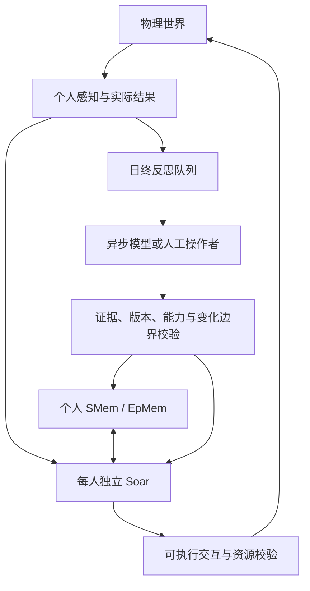

# 校园认知与异步反思

## 决策权和知识边界

每个人拥有独立 Soar agent。`school-policies.json` 提供共同规则与个人规则，`school-scene.json` 提供初始认知参数、关系和个人项目。传记是展示文字；真正参与比较的是结构化字段、实际经历、已知关系、承诺和目标。

世界只把观察者实际见闻送入该 agent。个人 SMem 是信念、关系、目标定义、步骤进度、反思记录的主存储；EpMem 保留原生认知时序。JavaScript 的个人记忆索引与缓存用于减少反复查询，不是另外一份全知心智。远处的人物位置使用最后见到的位置，未参加的私密谈话不会进入上下文。

## 关系、心情、人格不是同一个量

- **有向关系**：我对某人的信任、亲近、积怨、尊重，保存在我的 SMem。道歉、支持、排斥、违约等事件通过 tuning 的 appraisal 更新；旁观者只有实际听到且满足自己的评价条件才更新。
- **短期感受**：既有 Soar `mind.soar` 根据失约、合作等事件和个人敏感度形成针对对象的感受，并随时间衰减。
- **相对稳定的认知参数**：敏感度、社交主动、坚持、群体评价、体谅和表达立场等。LLM 可基于当次提供的证据建议小幅变化。默认单字段每天最多一次、数值最多变化 3、相对初始值累计偏移最多 24，始终在类型范围内。离散应对方式需要至少 3 个不同的已观察事件。允许没有变化。
- **策略**：条件化 Soar productions 和持久目标。参数本身不会产生语义行为，必须有规则引用。回归测试验证表达立场从 48 到 51 后，既有排斥记忆触发原生 `speak-up-against-exclusion` 选择。

这些是可扩展的游戏认知变量和解释机制，不是一个经过心理学验证的人格量表。

## 跨人物、跨场景的谋划

目标包含动机、涉及人物、有效时段、截止、优先级、步骤、替代方法、等待条件和终止条件。例如：向 A 表明界限 → 离开 → 向 B 道歉 → 提出重新来往 → 等待 B 的自主回应 → 继续日常。

步骤和进度保存在原生记忆。找人或打开谈话只是前置方法，不能把“道歉”步骤标成完成。被上课、用餐或其他交互打断后，未完成目标仍在；恢复时重新检查可见对象、发言权和设施。`successWhen`/`abandonWhen` 可提前结束目标，`until` 步骤用于等待对方的结果；若需要保证全程达成某个结果，把它明确写成等待步骤。

邀请、发言权、物品交付、承诺和实际接受由世界协议执行。听见实际接受后，以 `interaction-result` 更新 Soar 记忆，区别于未经验证的第三方转述。提出邀请本身不构成同意。

## 模型运行和性能

- 模拟在 Worker 中推进，渲染在主线程。每次前端请求最多推进 0.5 游戏分钟。
- 普通决策按轮转分摊，每个子步通常最多 2 人；紧急需求、课程切换和邀请可超过该软预算，避免把上课和回应拖延到队尾。已有行走/活动每步持续推进。
- 每日 18:00 只登记轻量任务。获得调用名额后才构造个人上下文；不会在模拟 tick 等待模型 Promise。
- `InferenceBroker` 控制并发、滚动每分钟次数、截止和取消；本地 HTTP 服务再做一次全局限制。默认并发 1、每分钟 4 次、60 秒服务端截止。
- 上下文保留最多 40 个相关日内事件，其中优先保留社交事件，再加当前目标、个人关系、允许动作和规则契约。不是整个世界快照。
- 读档重建世代，取消旧请求；排队的日终任务恢复。请求携带规则版本、内容版本、依赖与世代，安装前重新校验。错误/超时保留旧规则。
- 日终任务完成历史保留最近 14 天；原生长期记忆仍持久保存。尚未实现长期记忆遗忘或任意规模负载治理。

分别记录请求实际等待 `inferenceMs` 和校验安装 `applyMs`；前端也显示渲染及位置更新间隔。人工接管等待包含操作者阅读、编写和工具操作，不能当作供应商延迟。具体测试值在 `research/runtime/`，并非不同设备上的帧率保证。

## 扩展与限制

新的关系维度、事件评价、认知字段、行动定义和策略都通过内容注册。LLM 只能组合已注册能力，不能写任意 JavaScript 或替其他角色决定结果。新社会协议与新物理效果需要实现对应通用 primitive。

当前任务是个体反思；没有加入动态导演替全班编排结局，也没有把校园规则每日任意改写。全局 tuning 可通过已有扩展接口增加，个人反思补丁只改变该角色的知识、策略和目标。
